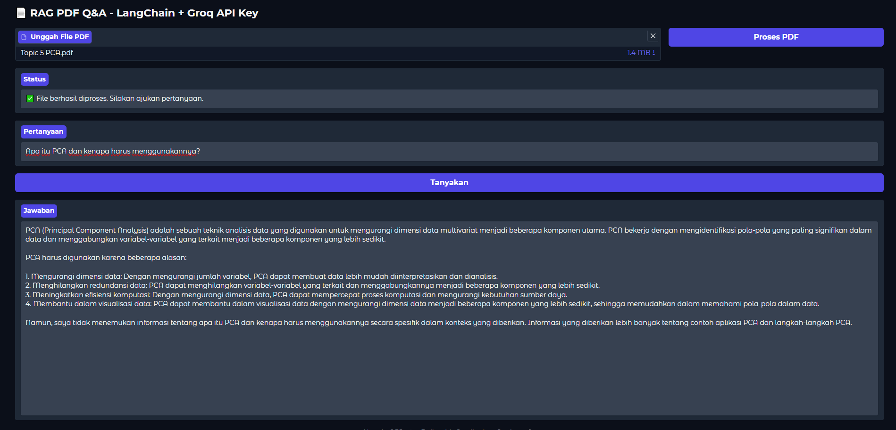
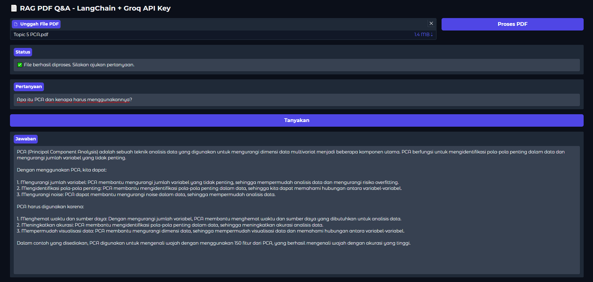
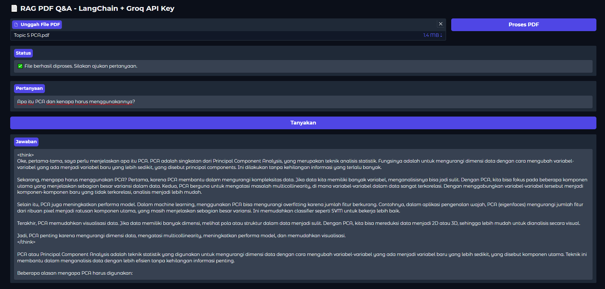
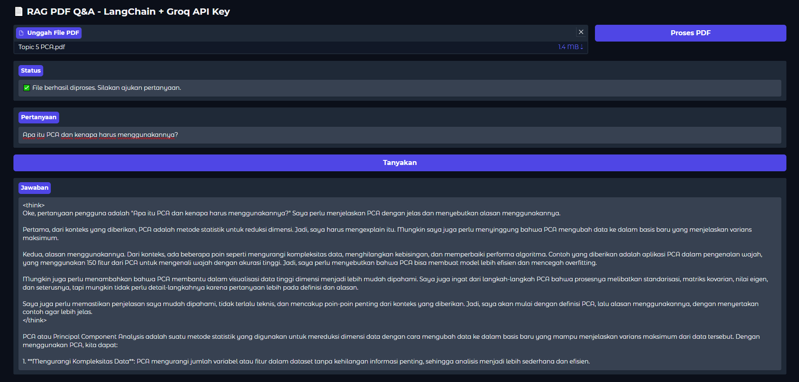
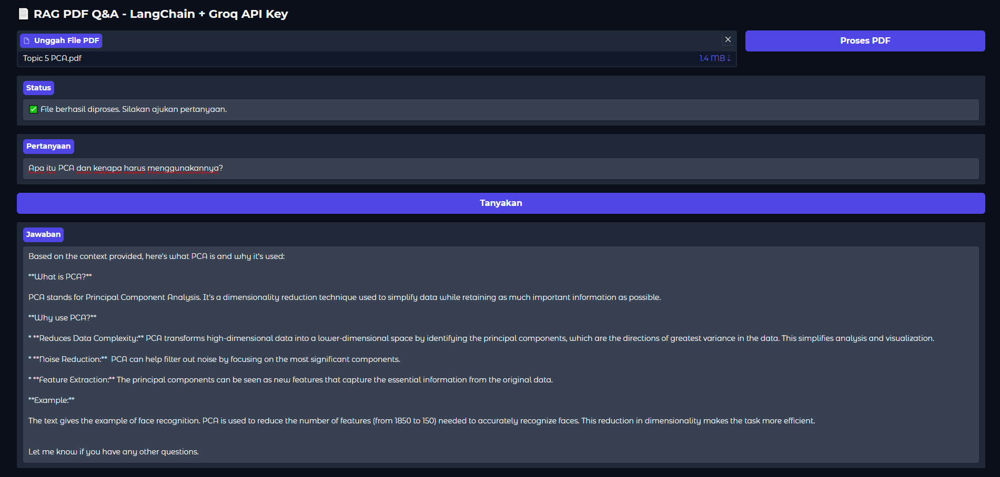
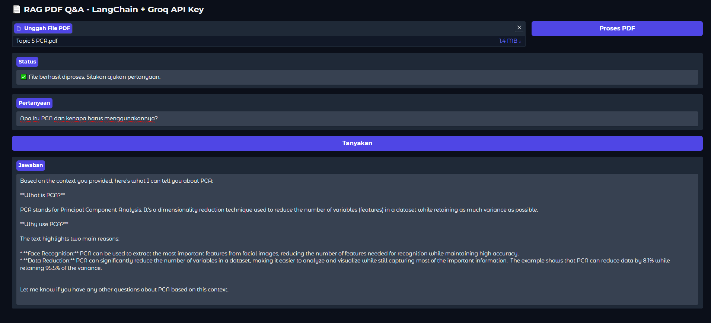

<h1 align="center"> Retrieval-Augmented Generation with Gradio and Groq API Key</h1>
<p align="center"> Natural Language Processing Project</p>

<div align="center">


</div>

### Name : Harjuno Abdullah
### Tech Stack : Python, Gradio, LangChain, HuggingFace Embedding, FAISS vector store

---

### 1. Analysis about how the project works

This project demonstrates a simple yet powerful implementation of Retrieval-Augmented Generation (RAG) using:

- **LangChain** for integrating retrieval and generation logic.
- **FAISS** for building a fast and efficient vector similarity search index.
- **HuggingFace Embedding** models for converting document text into vector representations.
- **Gradio** for creating a user-friendly interface.
- **Groq API** for querying high-performance LLMs like LLaMA, DeepSeek, and Gemma.

#### Workflow Overview:
1. A user uploads a PDF file containing the context or knowledge base.
2. The document is split into manageable chunks.
3. Each chunk is embedded into vector space using HuggingFace embeddings.
4. The vectors are indexed in FAISS for efficient similarity search.
5. When the user asks a question, the system retrieves the top-k most relevant chunks.
6. These chunks are provided to the selected language model (via Groq) to generate an answer grounded in the uploaded document.

#### Evaluation Prompt:
To test and compare different model behaviors, the same prompt was used:
> **"Apa itu PCA dan kenapa harus menggunakannya?"**

Each response was captured under different temperature settings for thorough analysis.

---

### 2. Analysis about how different every model works on Retrieval-Augmented Generation

```python
def get_llm():
    return ChatGroq(
        groq_api_key=GROQ_API_KEY,
        model_name="llama-3.3-70b-versatile", # Change the model in the code
        temperature=0.2
    )
```
- Model used : ```[llama-3.3-70b-versatile, deepseek-r1-distill-llama-70b, gemma2-9b-it]```

#### 2.1 llama-3.3-70b-versatile

At temperature 0.2, this model gave a textbook-style explanation of PCA—accurate, organized, and highly structured. It emphasized the core reasons for using PCA such as dimensionality reduction, reducing redundancy, and improving computational efficiency. The response was reliable and suitable for technical or academic use cases.

At temperature 0.8, the model expanded more creatively. It introduced concrete use cases like face recognition and added richer context around benefits. The output had a more natural tone and broader elaboration, making it suitable for users looking for a more engaging or explanatory answer.

**Temperature: 0.2**


**Temperature: 0.8**


---

#### 2.2 deepseek-r1-distill-llama-70b

This model stood out by simulating a “thought process” in the 0.8 version, which added transparency to how it builds its answer. At 0.2, it gave a structured summary covering PCA fundamentals such as reducing multicollinearity, enhancing model performance, and simplifying visualization. 

At 0.8, the model added more depth, referencing eigenfaces in face recognition and even explaining why reducing dimensions benefits machine learning workflows. This makes it a strong candidate for educational explanations.

**Temperature: 0.2**


**Temperature: 0.8**


---

#### 2.3 gemma2-9b-it

Gemma2-9b-it provided the most concise outputs across both temperatures. At 0.2, its response was minimalistic and directly informative, making it ideal for quick lookups or embedded chatbot scenarios.

At 0.8, while still brief, it incorporated example-based reasoning (like PCA in face recognition) and introduced numerical metrics, such as how much variance is retained—adding a practical touch without overwhelming the user.

**Temperature: 0.2**


**Temperature: 0.8**


---

### 3. Analysis about how temperature works

```python
def get_llm():
    return ChatGroq(
        groq_api_key=GROQ_API_KEY,
        model_name="llama-3.3-70b-versatile",
        temperature=0.2 # Change the temperature value here and analzye
    )
```

#### 3.1 Analysis on higher temperature (0.8)

At a higher temperature setting, such as 0.8, the language models tend to generate outputs that are more expressive, diverse, and sometimes less predictable. This is useful when you want the model to explore more phrasing options or surface less obvious associations.

In this experiment:

- **llama-3.3-70b-versatile** provided a broader explanation of PCA, incorporating use cases and highlighting its practical benefits in tasks like face recognition.
- **deepseek-r1-distill-llama-70b** demonstrated a visible reasoning chain ("thinking aloud") and structured its response with richer context, making it feel more interactive and analytical.
- **gemma2-9b-it**, even at 0.8, remained fairly concise but added practical figures (e.g., variance retained) and examples, improving clarity without becoming verbose.

The high-temperature setting is well-suited for:
- Educational applications where detail and elaboration matter.
- Exploratory dialogues where varied phrasing improves engagement.
- Brainstorming use cases where creativity is desired over precision.

#### 3.2 Analysis on lower temperature (0.2)

A lower temperature value like 0.2 makes the model behave more deterministically, prioritizing consistency and directness. Responses are typically concise, well-structured, and less likely to include tangents or variation.

In this test:

- **llama-3.3-70b-versatile** delivered a clean and informative breakdown of PCA’s purpose, applications, and benefits—ideal for technical documentation.
- **deepseek-r1-distill-llama-70b** stayed logical and fact-driven, outlining core concepts like dimensionality reduction and multicollinearity avoidance with clarity.
- **gemma2-9b-it** generated short, efficient summaries suitable for quick reference or chatbot responses.

Low-temperature configurations are ideal for:
- Technical explanations or research-oriented contexts.
- Scenarios that demand accuracy, minimal variation, and repeatability.
- Environments where consistency in tone and content is crucial.

### 4. How to run the project

- Clone this repository with : 

```git
git clone https://github.com/hrjuno/RAG_with_GroqAPI.git
```

- Copy the ```.env.example``` file and rename it to ```.env```

```
GROQ_API_KEY=your-groq-api-key
```

- Fill the ```GROQ_API_KEY``` with your Groq API Key, find it here : https://console.groq.com/keys

- Create Virtual Environment
```bash
python -m venv venv
source venv/bin/activate   # macOS/Linux
venv\Scripts\activate      # Windows
```

- Install Dependencies
```bash
pip install -r requirements.txt
```

- Run the App. Gradio will launch the app on a local server.
```bash
python app.py
```

- Modify model and temperature. In `app.py`, change the model or temperature like this:
```python
model_name="deepseek-r1-distill-llama-70b",
temperature=0.2
```

- Try different values and observe the response quality.

- Push to GitHub
```bash
git remote set-url origin https://github.com/<YourRepo>/RAG_with_GroqAPI.git
git add .
git commit -m "RAG with Groq"
git push origin master
```
